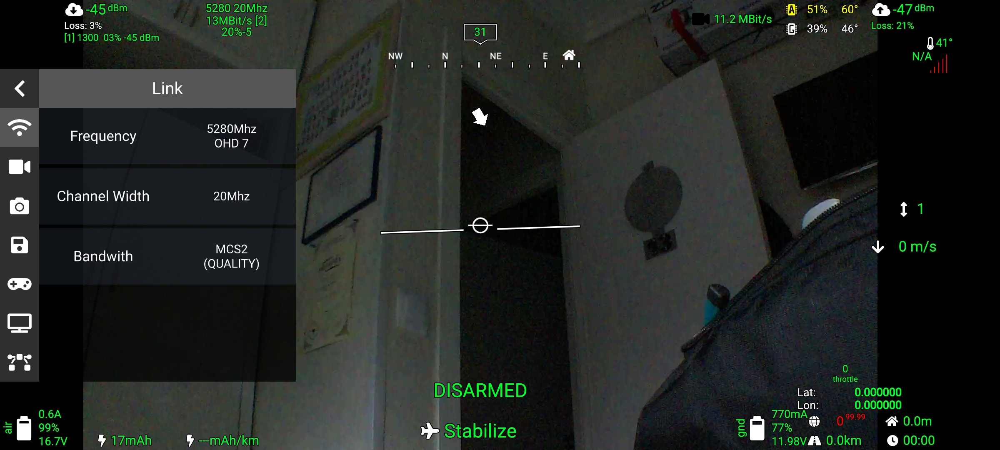

To ensure you don't have surprise shutdowns on your Ground unit, it can be very convenient to monitor the Voltage and Current that are supplied to the system in the OSD

INA219 - Simple and efficient
Using the INA219 modules, readily available from sources like AliExpress is a simple and efficient way to add Ground Power monitoring. The module is easy to attach to the Ground unit using I2C. The following pictures and diagrams should be all you need. If the system finds the device attached it will automatically enable the functionality.

By default is OFF you need to turn on the widget on the OSD tab, its called "Show ground battery"

