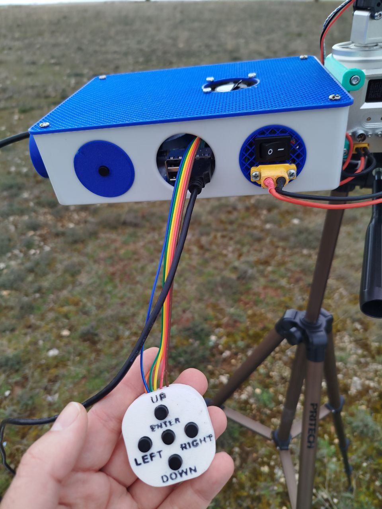
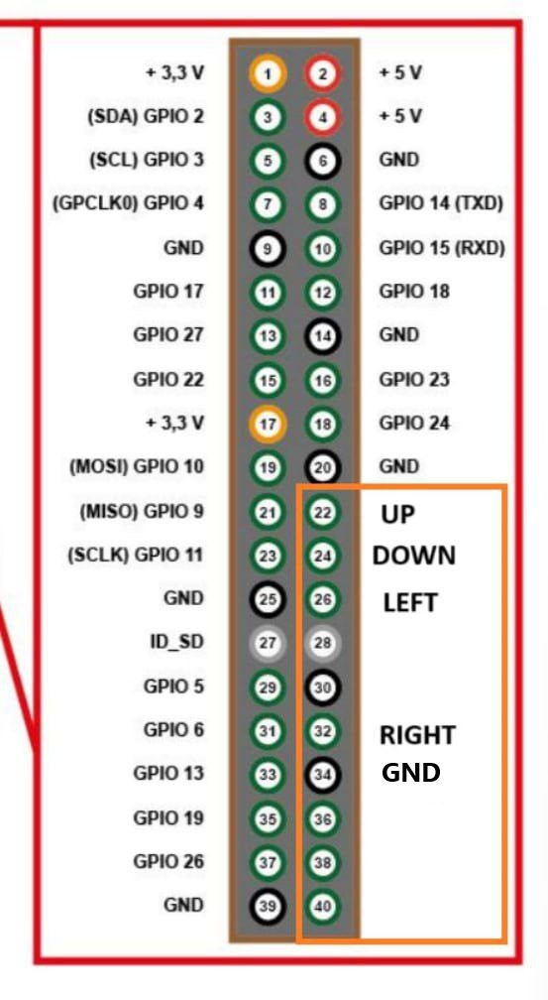
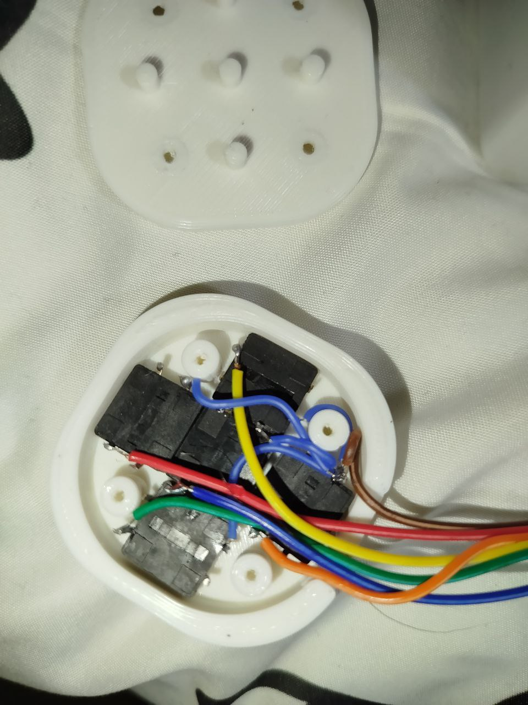
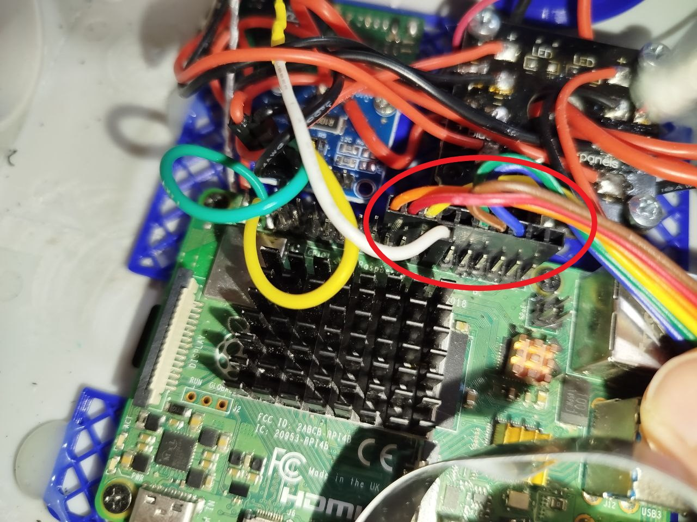

<!-- LEGACY DOCUMENTATION NOTICE -->
> ⚠️ **This documentation is outdated!** A current version is available at [openhdfpv.org](https://openhdfpv.org)
> 
> [📖 **View Updated Version of This Page** →](https://openhdfpv.org)

---

Having a wide range of options is OpenHD hallmar and since we are focusing on introducing all the changes that a pilot would nedd to make during a flight in the sidebar, we are introducing the new Joystick to allow to make the changes without a touchscreen and without the mess that can be a mouse.

The sidebar as is designed works like a organigramme so you only need "UP" "DOWN" "RIGHT" and "LEFT" to make all the changes ("ENTER" is there just for the future but now it doesnt do anything)
You just need 4 buttons that shorts to ground a GPIO pin each time to make a mouvement.

Here is the pinout:

And here is a example of a joystick:

In case you need to change any pin in the ground raspberry pi because of a damage in one pin you need to edit the .txt on the ground sbc named config.txt and scroll down to the bottom until you find "Adding joystick"
