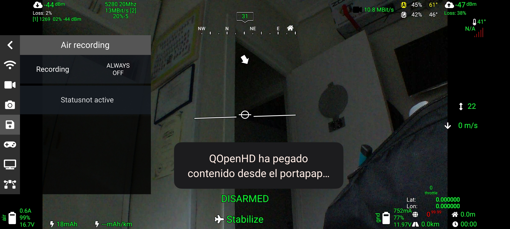
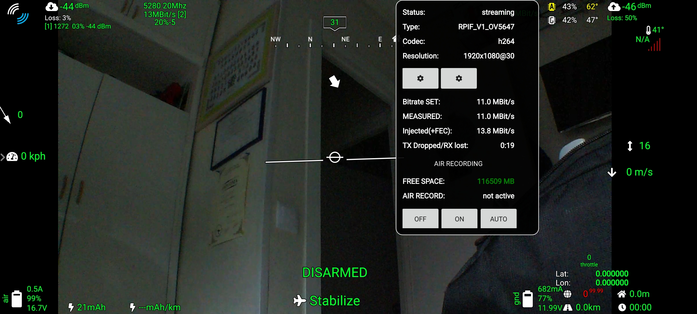

# Air Recording Guide

Record your flights locally on your air unit with minimal performance impact. The recorded video maintains the same bitrate as the transmitted video but is free from breakups due to packet loss since it's stored locally on your air unit, not the ground unit.

To enable this feature:

1. Enable video recording for a connected camera. You have two options or using the sidebar or the video statistic tab.
You can set it to OFF, ON or Auto, in AUTO the system will start recording automatically when arm the UAV

2. To access and view the recordings, you have two options:

- **Option a**: After a flight, remove the SD card from your air unit and insert it into a card reader. You can find the recordings in the partition named "RECORDINGS".

- **Option b**: After a flight, enable the "Wi-Fi hotspot" on your air Pi (requires a Pi with integrated Wi-Fi). Connect your phone or PC to the Pi's Wi-Fi network, open a web browser, enter the Pi's IP address. You will access its web interface, where you can find the video files.

# Recording Widget

You will see a red dot next to camera icon and MBits
