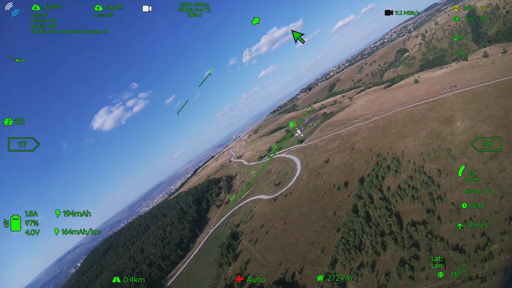
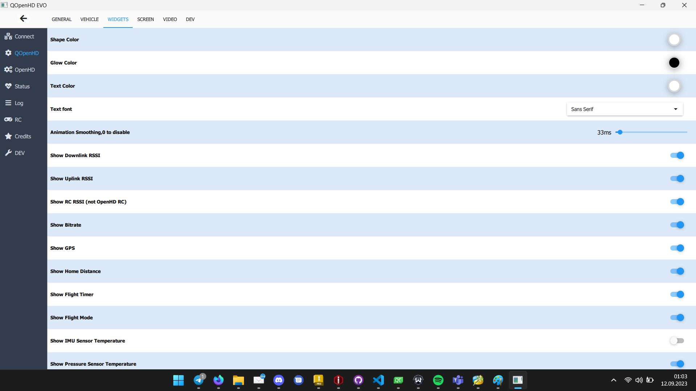

# Comparison of:
# OpenIPC, OpenHD, WFB-NG, Ruby FPV, and EZ-Wifibroadcast

| Feature           | OpenHD               | OpenIPC (FPV)               | WFB-NG                | Ruby FPV              | EZ-Wifibroadcast     |
|-------------------|----------------------|-----------------------|------------------------|-----------------------|----------------------|
| Development       | Active, daily changes | Active, weekly changes | Active, monthly changes | Active, monthly changes | Inactive           |
| Purpose           | Comprehensive FPV drone suite | IP camera firmware + FPV + OSD | FPV video link and OSD | FPV video link and OSD | FPV video link and OSD |
| Hardware Support*  | Raspberry Pi 2, 3, 4, Zero 2, Rock5, X86, Radxa CM3, Zero3W, X20,... | some IP cameras | Raspberry Pi 2, 3, Zero 1, 2  | Raspberry Pi 2, 3, 4, Zero 1, 2 | Raspberry Pi 1A+, 1B+, 2B, 3B |
| Supported Cameras* | Excellent | Excellent | Excellent | Excellent | Adequate |
| Multicamera       | Yes | Yes | No | No | No |
| Dynamic Settings  | Yes | Yes | No | Yes | No |
| User-friendliness | 9 | 5 | 3 | 9 | 3 |
| Control Range *** | Long range | Long range | Long range | Long range**** | Long range |
| Customization     | Extensive | Extensive | Extensive | Extensive | Adequate |
| Updates           | Frequent (monthly) | Frequent (weekly) | Limited | Frequent (monthly) | Non-existent |
| Open Source       | Yes | Partially | Yes | Yes | Yes |
| Usual Setup Costs       | 57€*** | 87€*** | 150€*** | 100€*** | 145€*** |
| Latency on 720p (x86)  **   | 110 | 100 | 150 | NA | NA |
| Latency on 720p (rpi)  **   | 120 | 70 | 120 | 125 | 120 |

*Only officially listed devices
*** prices are calculated and listed from the links on the bottom of the page, usual prices are used, no discounts or blackfriday sales
**Measurements are done with the setup that is mentioned above ,osd,telemetry,FEC,link optimisations enabled with their standard groundstation, on QGroundControl or Mission Planner, the latency will be much higher.
*** Using same same radio interfaces, same antennas, same tx power, same environment;
**** When disabling adaptive video, adaptive radio link, retransmissions;
 

## Software Usage and Selling Points

**OpenHD**: OpenHD is a comprehensive FPV suite that includes flashing software, a dynamic OSD, and ground station software. It offers multi-platform support, multi-ground station support, and external viewing and configuration on Android, Windows, and Mac, with planned support for iOS and web browsers. OpenHD is actively developed with a large and extensive community, developer group, and commercial partners. It also has a live Map, showing your live plane position. Its main selling points include daily development, multi-platform support, a vibrant community, and intense work on new drivers, hardware, SOCs, and custom cameras in collaboration with Veye-Imaging and Arducam. OpenHD is also building custom hardware specific for FPV usage, which is extremely small and powerful and also utilized Cameras which are specially made for the FPV application.

**OpenIPC**: OpenIPC is advanced IP camera software known for its excellent usability and configurability, primarily focused on improving and enhancing functionality for security devices. A portion of OpenIPC, called "sandbox-fpv," adds FPV functionality to select OpenIPC devices. This feature is available for a few specific devices and can utilize a lite version of OpenHD or WFB-NG. When using the lite OpenHD version, it can be used with QOpenHD, the OpenHD Companion App. OpenIPC's main selling points are its usability, configurability, extensive hardware platforms support and security device enhancements. OpenIPC can also utilise special NVR board to view the Link with an osd.

**WFB-NG**: WFB-NG is a long-range packet radio link based on raw WiFi radio, accompanied by a few companion scripts and a Raspberry Pi 3 image (additional unofficial builds are available). Its primary focus is on the RF link, with basic OSD functionality for FPV use. WFB-NG is designed for developers who want to integrate it into their own systems. Its main selling point is a very optimized and slim link, which can be compiled (without the OSD) on many platforms.

**Ruby FPV**: Ruby FPV is a dedicated complete drone controll & FPV video system. It features an extended and user-friendly OSD and emphasizes package retransmission, adaptive video link, adaptive radio link to improve video signal stability. It also has a relay mode. And OTA updates. The main selling points of Ruby FPV are its user-friendliness, Google-friendly features, and focus on delivering a reliable FPV experience.

**EZ-Wifibroadcast**: EZ-Wifibroadcast is the predecessor of OpenHD, laying the groundwork for what we now know as OpenHD. It was the first software focused on easing the configurability and usability of the Wifibroadcast-Link.

## Supported Camera Sensors

**OpenHD**: OV5647, IMX219, IMX477, IMX477m, SC132, AR1335, AR1820HS, OG02B10, AR0234, OV2311,IMX230, IMX290, IMX298, IMX307, IMX327, IMX335, IMX385, IMX462, IMX519, IMX708 + "X20-Cameras"* HDMI-Cameras + IP Cameras + USB-Cameras + Thermal-Cameras

**OpenIPC**: IMX307, IMX335, IMX 415

**WFB-NG**: OV5647, IMX219, IMX477, IMX477m (red tint), IMX519 + HDMI-Cameras

**Ruby FPV**: OV5647, IMX219, IMX477, IMX209, IMX327 + HDMI-Cameras + OpenIPC cameras (see above)

**EZ-Wifibroadcast**: OV5647, IMX219, IMX477, IMX209, IMX327 + HDMI-Cameras

### Why is there such a big difference?

**OpenHD** is actively cooperating with **Veye-Imaging** and **Arducam**, and develops custom cameras with **Arducam**. 

What cameras exactly are made in cooperation with **OpenHD** and **Arducam**?

- IMX477m
- IMX462
- IMX327
- IMX290
- IMX708
- More will follow

* These cameras are currently not named for various reasons, but will be updated when the embargo is lifted.

**OpenIPC** uses custom firmware on regular IP-Cameras.

**WFB-NG** uses everything that is already compatible with the standard Raspberry Pi Kernel (v5.1).

**EZ-Wifibroadcast** uses everything that is already compatible with the standard Raspberry Pi Kernel (v4.x).

## Installation and Configuration

**OpenHD**: Install the official Image writer, set your initial settings, ready! Further configuration can be done in QOpenHD on the Groundstation or any other connected device. < 15minutes

**OpenIPC**: Locate the correct uart-points, solder Uart-Debugger to it, search for fitting firmware, flash custom firmware to the board, connect via ssh and do manual installation and configuation of various tools, repeat for the groundstation. https://www.youtube.com/watch?v=libsusKy6zc ~1h

**WFB-NG**: Configuration is done via SSH on the devices. < 30min

**Ruby FPV**: Configuration is done after flashing in the system on SD cards. < 15min

**EZ-Wifibroadcast**: Configuration is done via config files on the SD card. < 15min

## Drivers for the "flagship" Wi-Fi chipset

**OpenHD**: Highly modified and improved version of the Aircrack v5.2.20 driver, with improved bandwidth, channel, tx-power settings which are dynamically changeable [8812au/8812bu], constant development on newer drivers.

**OpenIPC**: Basic AirCrack driver, no 40MHz, no custom channels, static* TX-Power override [8812au].

**WFB-NG**: Modified version of the AirCrack driver, improved channels + static* TX-Power override [8812au].

**Ruby FPV**: Depending on HW platform, uses modified version of the AirCrack driver, or WFB-Ng driver [8812au].

**EZ-Wifibroadcast**: Fixed MCS, fixed tx-power, only 2.4GHz [ath9k].

*For changing, another device needs to be connected to both air and ground, and new levels must be set + a reboot is needed.

## Main Disadvantages

**OpenHD**: Because of its high complexity and intelligent FEC, it needs more processing power than lower complexity systems -> no support for hardware that is more than 10 years old. Also the goggle-navigation is not finished, yet.

**OpenIPC**: Because of its nature to hack IP cameras, high knowledge and good soldering and programming equipment are needed. Documentation is either in russian, wrong, or totally outdated, direct communication with the devs is recommended. Very harsh environment for newbies. Highly dependant on "e-waste" hardware. It's also very limited in performance and space, which means that only the bare minimum functions are included and there isn't much space to add new ones, which means no dual Video no dynamic Settings, no high fec-percentages,normally low bandwith, no hotspots,no 40mhz mode, ...

**WFB-NG**: Because of its complex and undynamic setup, and very outdated/slim wiki, configuration is a pain, the user needs to connect and change the system manually for most things.

**Ruby FPV**: 

**EZ-Wifibroadcast**: Because of its discontinuation 4 years ago, there is no real chance to get updates here.

## Different OSD/rendering methods:

**OpenHD**: Using the HW-Compositor on the RPI to render the OSD on top of the Video -> lowest Latency possible on the hardware (Pi, Rock5, rk3566) [FFMPEG on X86]. Custom renderer is already being worked on.

**OpenIPC**: Nowadays using a NVR (network video recorder), for displaying. Using Vdec video renderer to HW-Compositor. Only possible on the NVR-board. Alternative Hardware does not run the OSD and therefore either uses Autovideosink or QOpenHD.

**WFB-NG**: Using a very old discontinued method to draw over the HW-Compositor -> same latency like OpenHD, but simpler OSD, and not usable on Pi 4 and newer kernels.

**Ruby FPV**: Using discontinued rendering methods to draw over the HW-Compositor -> same latency like OpenHD

**EZ-Wifibroadcast**: Using discontinued rendering methods to draw over the HW-Compositor -> same latency like OpenHD, but no support for anything but the Pi 1-3.

# Configuration and User Interfaces

## OSD

**QOpenHD**  

**OpenIPC**  

**WFB-NG**  

**Ruby FPV**  

**EZ-Wifibroadcast**  

## Configuation

**OpenHD**  

**OpenIPC**  
Text Files

**WFB-NG**  
Text Files

**Ruby FPV**  

**EZ-Wifibroadcast**  
Text Files

## Medium Range Setup and Costs
- Not factoring in BEC's, wires, solder, programmer, monitor/googles, joysticks, ...
- Prices are from normal sellers (like aliexpress) excluding shippment, links are provided

### **OpenHD**

**Ground**
- [Radxa Zero3W](https://shop.allnetchina.cn/collections/rock-3/products/copy-of-radxa-zero-3w?variant=47222881288508) - 13,77€
- [Comfast Wifi Adapter 8812bu](openipcosd) - 11€
24.77€

**Air**
- [Radxa Zero3W](https://shop.allnetchina.cn/collections/rock-3/products/copy-of-radxa-zero-3w?variant=47222881288508) - 13,77€
- [Imx219](https://aliexpress.com/item/1005003774526287.html) - 6,99€
- [Comfast Wifi Adapter 8812bu](https://aliexpress.com/item/1005001311214882.html) - 11€
31.76€

Total Cost: 56.53€

### **OpenIPC**

**Ground**
- [RTL8812AU BL-R8812AF1](https://aliexpress.com/item/1005005249117355.html) - 12,51€
- [Mstar xmeye pro](https://aliexpress.com/item/1005005921198064.html) - 32,04€
44.55€

**Air**
- [Xmeye sony imx415 nt98566 4k ip kamera](aliexpress.com/item/1005005315306286.html) - 40€
- [RTL8812AU BL-R8812AF1](https://aliexpress.com/item/1005005249117355.html) - 12,51€
42.51€

Total Cost: 87.06€

### **WFB-NG**

**Ground**
- [Raspberry Pi 3](https://www.welectron.com/Raspberry-Pi-3-Modell-B-Made-in-UK_1) - 44€
- [Mini Realtek 8812AU](https://aliexpress.com/item/1005002595336788.html) - 13€

**Air**
- [Rpi-Zero](https://www.reichelt.de/de/en/raspberry-pi-zero-w-v-1-1-1-ghz-512-mb-ram-wi-fi-bt-rasp-pi-zero-w-p256438.html) - 18€
- [Arducam IMX477 mini](https://www.uctronics.com/arducam-12mp-imx477-mini-high-quality-camera-module-for-raspberry-pi.html) - 75€
- [Mini Realtek 8812AU](https://aliexpress.com/item/1005002595336788.html) - 13€

Total Cost (Air): 150€ + monitor

### **Ruby FPV**

**Ground**
- [Raspberry Pi 3](https://www.welectron.com/Raspberry-Pi-3-Modell-B-Made-in-UK_1) - 44€
- [Mini Realtek 8812AU](https://aliexpress.com/item/1005002595336788.html) - 13€

*Monitor is also needed, but for fairness, I'll not factor the price in.*

**Air**
- [Rpi-Zero](https://www.reichelt.de/de/en/raspberry-pi-zero-w-v-1-1-1-ghz-512-mb-ram-wi-fi-bt-rasp-pi-zero-w-p256438.html) - 18€
- [Veye 327](https://www.amazon.com/VEYE-MIPI-327E-forRaspberry-Jetson-XavierNX-YT1-0-6I/dp/B08QHZCWSM?th=1) - 70€
- [Mini Realtek 8812AU](https://aliexpress.com/item/1005002595336788.html) - 13€

Total Cost (Air): 145€ + monitor

### **EZ-Wifibroadcast**

**Ground**
- [Raspberry Pi 3](https://www.welectron.com/Raspberry-Pi-3-Modell-B-Made-in-UK_1) - 44€
- [Mini Realtek 8812AU](https://aliexpress.com/item/1005002595336788.html) - 13€

*Monitor is also needed, but for fairness, I'll not factor the price in.*

**Air**
- [Rpi-Zero](https://www.reichelt.de/de/en/raspberry-pi-zero-w-v-1-1-1-ghz-512-mb-ram-wi-fi-bt-rasp-pi-zero-w-p256438.html) - 18€
- [Veye 327](https://www.amazon.com/VEYE-MIPI-327E-forRaspberry-Jetson-XavierNX-YT1-0-6I/dp/B08QHZCWSM?th=1) - 70€
- [Mini Realtek 8812AU](https://aliexpress.com/item/1005002595336788.html) - 13€

Total Cost (Air): 145€ + monitor
