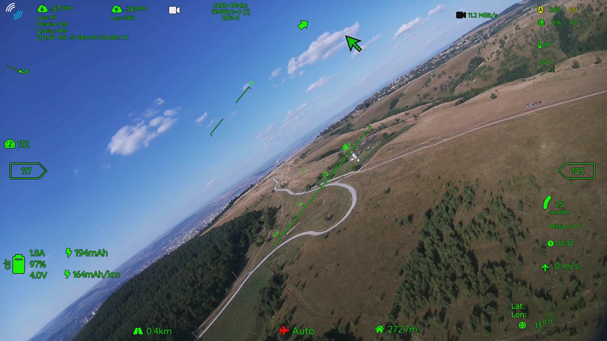
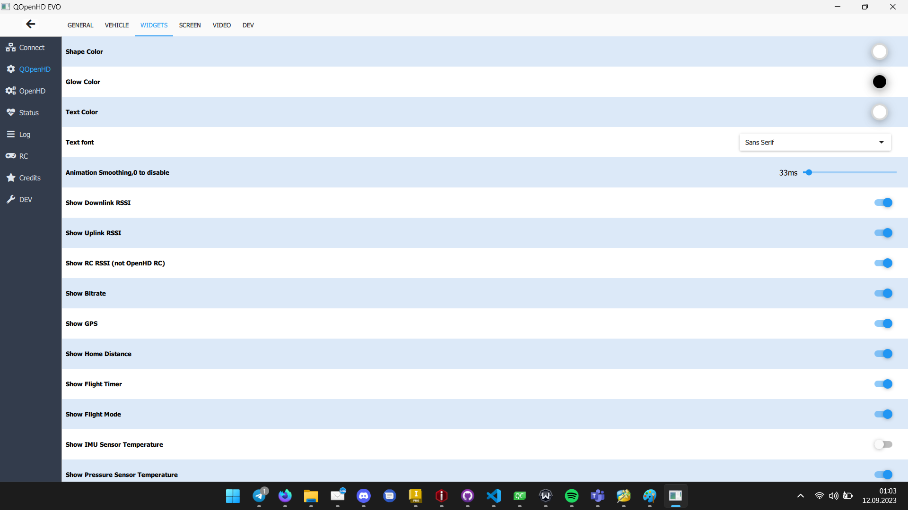

# Comparison of:
# OpenIPC, OpenHD, WFB-NG, Ruby FPV, and EZ-Wifibroadcast

| Feature           | OpenHD               | OpenIPC               | WFB-NG                | Ruby FPV              | EZ-Wifibroadcast     |
|-------------------|----------------------|-----------------------|------------------------|-----------------------|----------------------|
| Development       | Active, daily changes | Active, weekly changes | Active, monthly changes | Active, monthly changes | Inactive           |
| Purpose           | Comprehensive FPV drone suite | Advanced IP camera firmware | FPV video link and OSD | FPV video link and OSD | FPV video link and OSD |
| Hardware Support*  | Raspberry Pi 2, 3, 4, Zero 2, Rock5, X86 | IP cameras | Raspberry Pi 2, 3, Zero 1, 2 | Raspberry Pi 2, 3, 4, Zero 1, 2 | Raspberry Pi 1A+, 1B+, 2B, 3B |
| Supported Cameras* | Excellent | Adequate | Good | Adequate | Adequate |
| Multicamera       | Yes | No | No | No | No |
| Dynamic Settings  | Yes | No | No | Yes | No |
| User-friendliness | 9 | 1 | 3 | 10 | 3 |
| Control Range     | Long range | Limited | Long range | Limited | Long range |
| Customization     | Extensive | Non-existent | Extensive | Non-existent | Adequate |
| Updates           | Frequent | Periodic | Limited | Limited | Non-existent |
| Open Source       | Yes | Partially | Yes | Partially | Yes |
| Medium Range Setup Costs       | 79€ | 57€ | 150€ | 145€ | 145€ |

*Only officially listed devices

## Software Usage and Selling Points

**OpenHD**: OpenHD is a comprehensive FPV suite that includes flashing software, a dynamic OSD, and ground station software. It offers multi-platform support, multi-ground station support, and external viewing and configuration on Android, Windows, and Mac, with planned support for iOS and web browsers. OpenHD is actively developed with a large and extensive community, developer group, and commercial partners.It also has a live Map, showing your live plane position. Its main selling points include daily development, multi-platform support, a vibrant community, and intense work on new drivers, hardware, SOCs, and custom cameras in collaboration with Veye-Imaging and Arducam.

**OpenIPC**: OpenIPC is advanced IP camera software known for its excellent usability and configurability, primarily focused on improving and enhancing functionality for security devices. A portion of OpenIPC, called "sandbox-fpv," adds FPV functionality to select OpenIPC devices. This feature is available for a few specific devices and can utilize a lite version of OpenHD or WFB-NG (in older versions). When using the lite OpenHD version, it can be used with QOpenHD, the OpenHD Companion App. OpenIPC's main selling points are its usability, configurability, and security device enhancements.

**WFB-NG**: WFB-NG is a long-range packet radio link based on raw WiFi radio, accompanied by a few companion scripts and a Raspberry Pi 3 image (additional unofficial builds are available). Its primary focus is on the RF link, with basic OSD functionality for FPV use. WFB-NG is designed for developers who want to integrate it into their own systems. Its main selling point is a very optimized and slim link, which can be compiled (without the OSD) on many platforms.

**Ruby FPV**: Ruby FPV is a dedicated FPV video and telemetry system designed for FPV enthusiasts. It features an extended and user-friendly OSD (and goggle navigation) and emphasizes package retransmission to improve video signal stability. It also has a relay mode. And OTA updates. The main selling points of Ruby FPV are its user-friendliness, Google-friendly features, and focus on delivering a reliable FPV experience.

**EZ-Wifibroadcast**: EZ-Wifibroadcast is the predecessor of OpenHD, laying the groundwork for what we now know as OpenHD. It was the first software focused on easing the configurability and usability of the Wifibroadcast-Link.

## Supported Camera Sensors

**OpenHD**: OV5647, IMX219, IMX477, IMX477m, SC132, AR1335, AR1820HS, OG02B10, AR0234, OV2311,IMX230, IMX290, IMX298, IMX307, IMX327, IMX335, IMX385, IMX462, IMX519, IMX708 + HDMI-Cameras + IP Cameras + USB-Cameras + Thermal-Cameras

**OpenIPC**: IMX307, IMX335

**WFB-NG**: OV5647, IMX219, IMX477, IMX477m (red tint), IMX519 + HDMI-Cameras

**Ruby FPV**: OV5647, IMX219, IMX477, IMX209, IMX327 + HDMI-Cameras

**EZ-Wifibroadcast**: OV5647, IMX219, IMX477, IMX209, IMX327 + HDMI-Cameras

### Why is there such a big difference?

**OpenHD** is actively cooperating with **Veye-Imaging** and **Arducam**, and develops custom cameras with **Arducam**. 

What cameras exactly are made in cooperation with **OpenHD** and **Arducam**?

- IMX477m
- IMX462
- IMX327
- IMX290
- IMX708
- More will follow

**OpenIPC** uses "hacked" IP-Cameras, and low latency implementations were only written for the IMX307.

**WFB-NG** uses everything that is already compatible with the standard Raspberry Pi Kernel (v5.1).

**Ruby FPV** uses the old OpenHD 4.9 kernel and utilizes every camera compatible with it

**EZ-Wifibroadcast** uses everything that is already compatible with the standard Raspberry Pi Kernel (v4.x).

## Installation and Configuration

**OpenHD**: Install the official Image writer, set your initial settings, ready! Further configuration can be done in QOpenHD on the Groundstation or any other connected device.

**OpenIPC**: Modify your board, sometimes buying another NAND chip is necessary, flash custom firmware to the new NAND, resolder it, flash the software, and configure via majestics or SSH.

**WFB-NG**: Configuration is done via SSH on the devices.

**Ruby FPV**: Configuration is done after flashing in the OSD.

**EZ-Wifibroadcast**: Configuration is done via config files on the SD card.

## Drivers for the "flagship" Wi-Fi chipset

**OpenHD**: Highly modified and improved version of the Aircrack v5.2.20 driver, with improved bandwidth, channel, tx-power settings which are dynamically changeable [8812au/8812bu].

**OpenIPC**: Basic AirCrack driver, no 40MHz, no custom channels, static* TX-Power override [8812au].

**WFB-NG**: Modified version of the AirCrack driver, improved channels + static* TX-Power override [8812au].

**Ruby FPV**: Using old OpenHD drivers based on a very old Aircrack driver, reboot required on TX-Power override [8812au].

**EZ-Wifibroadcast**: Fixed MCS, fixed tx-power, only 2.4GHz [ath9k].

*For changing, another device needs to be connected to both air and ground, and new levels must be set + a reboot is needed.

## Main Disadvantages

**OpenHD**: Because of its high complexity and intelligent FEC, it needs more processing power than lower complexity systems -> no support for hardware that is more than 10 years old. And there is no easy Goggle-navigation (yet).

**OpenIPC**: Because of its nature to hack IP cameras, high knowledge and good soldering and programming equipment are needed. No Groundstation with OSD yet (uses QOPENHD).It's also very limited in performance and space, which means that only the bare minimum functions are included and there isn't much space to add new ones, which means no dual Video no dynamic Settings, no high fec-percentages, no hotspots,no 40mhz mode, ...

**WFB-NG**: Because of its complex and undynamic setup, and very outdated/slim wiki, configuration is a pain, the user needs to connect and change the system manually for most things.

**Ruby FPV**: Because of its neglect of modern systems and inability to change to newer kernels or devices, there is no upgrade path for new hardware. Since the license is quite non-standard and parts are not documented and not open source and only one developer working on the project, features are slowly integrated and a lot is not possible to be changed without a complete redesign (render method, camera-implementation, etc.).

**EZ-Wifibroadcast**: Because of its discontinuation 4 years ago, there is no real chance to get updates here.

## Different OSD/rendering methods:

**OpenHD**: Using the HW-Compositor on the RPI to render the OSD on top of the Video -> lowest Latency possible on the hardware (Pi, Rock5) [FFMPEG on X86].

**OpenIPC**: Using QOpenHD, which is the same as above, or using QGroundControl which is not latency-optimized and uses a few frames buffered + CPU Copy.

**WFB-NG**: Using a very old discontinued method to draw over the HW-Compositor -> same latency like OpenHD, but simpler OSD, and not usable on Pi 4 and newer kernels.

**Ruby FPV**: Using discontinued rendering methods to draw over the HW-Compositor -> same latency like OpenHD, but no support for anything but the Pi 1-3.

**EZ-Wifibroadcast**: Using discontinued rendering methods to draw over the HW-Compositor -> same latency like OpenHD, but no support for anything but the Pi 1-3.

# Configuration and User Interfaces

## OSD

**QOpenHD**  

**WFB-NG**  

**Ruby FPV**  

**EZ-Wifibroadcast**  

## Configuation

**OpenHD**  

**OpenIPC**  
Text Files

**WFB-NG**  
Text Files

**Ruby FPV**  

**EZ-Wifibroadcast**  
Text Files

## Medium Range Setup and Costs

### **OpenHD**

**Ground**
- X86 Laptop
- [Comfast Wifi Adapter 8812bu](https://aliexpress.com/item/1005001311214882.html) - 11€

**Air**
- [Rpi-Zero2](https://shop.mchobby.be/en/pi-zero-12wwh/2334-raspberry-pi-zero-2-with-header-wireless-cam-conn-3232100023345.html) - 22€
- [Arducam SkyMasterHDR](https://www.arducam.com/product/presalearducam-12mp-imx708-hdr-120-wide-angle-camera-module-with-m12-lens-for-raspberry-pi/) - 35€
- [Comfast Wifi Adapter 8812bu](https://aliexpress.com/item/1005001311214882.html) - 11€

Total Cost: 79€

### **OpenIPC**

**Ground**
- X86 Laptop
- [Mini Realtek 8812AU](https://aliexpress.com/item/1005002595336788.html) - 13€

**Air**
- [Imx307Lqr Goke Gk7205V200](https://aliexpress.com/item/1005005185165767.html) - 28€
- [New Memory part](https://aliexpress.com/item/1005003093500630.html) - 3€
- [Mini Realtek 8812AU](https://aliexpress.com/item/1005002595336788.html) - 13€

Total Cost: 57€

### **WFB-NG**

**Ground**
- [Raspberry Pi 3](https://www.welectron.com/Raspberry-Pi-3-Modell-B-Made-in-UK_1) - 44€
- [Mini Realtek 8812AU](https://aliexpress.com/item/1005002595336788.html) - 13€

*Monitor is also needed, but for fairness, I'll not factor the price in.*

**Air**
- [Rpi-Zero](https://www.reichelt.de/de/en/raspberry-pi-zero-w-v-1-1-1-ghz-512-mb-ram-wi-fi-bt-rasp-pi-zero-w-p256438.html) - 18€
- [Arducam IMX477 mini](https://www.uctronics.com/arducam-12mp-imx477-mini-high-quality-camera-module-for-raspberry-pi.html) - 75€
- [Mini Realtek 8812AU](https://aliexpress.com/item/1005002595336788.html) - 13€

Total Cost (Air): 150€ + monitor

### **Ruby FPV**

**Ground**
- [Raspberry Pi 3](https://www.welectron.com/Raspberry-Pi-3-Modell-B-Made-in-UK_1) - 44€
- [Mini Realtek 8812AU](https://aliexpress.com/item/1005002595336788.html) - 13€

*Monitor is also needed, but for fairness, I'll not factor the price in.*

**Air**
- [Rpi-Zero](https://www.reichelt.de/de/en/raspberry-pi-zero-w-v-1-1-1-ghz-512-mb-ram-wi-fi-bt-rasp-pi-zero-w-p256438.html) - 18€
- [Veye 327](https://www.amazon.com/VEYE-MIPI-327E-forRaspberry-Jetson-XavierNX-YT1-0-6I/dp/B08QHZCWSM?th=1) - 70€
- [Mini Realtek 8812AU](https://aliexpress.com/item/1005002595336788.html) - 13€

Total Cost (Air): 145€ + monitor

### **EZ-Wifibroadcast**

**Ground**
- [Raspberry Pi 3](https://www.welectron.com/Raspberry-Pi-3-Modell-B-Made-in-UK_1) - 44€
- [Mini Realtek 8812AU](https://aliexpress.com/item/1005002595336788.html) - 13€

*Monitor is also needed, but for fairness, I'll not factor the price in.*

**Air**
- [Rpi-Zero](https://www.reichelt.de/de/en/raspberry-pi-zero-w-v-1-1-1-ghz-512-mb-ram-wi-fi-bt-rasp-pi-zero-w-p256438.html) - 18€
- [Veye 327](https://www.amazon.com/VEYE-MIPI-327E-forRaspberry-Jetson-XavierNX-YT1-0-6I/dp/B08QHZCWSM?th=1) - 70€
- [Mini Realtek 8812AU](https://aliexpress.com/item/1005002595336788.html) - 13€

Total Cost (Air): 145€ + monitor
