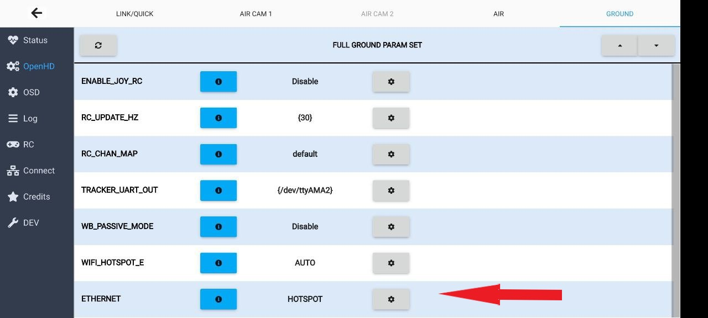
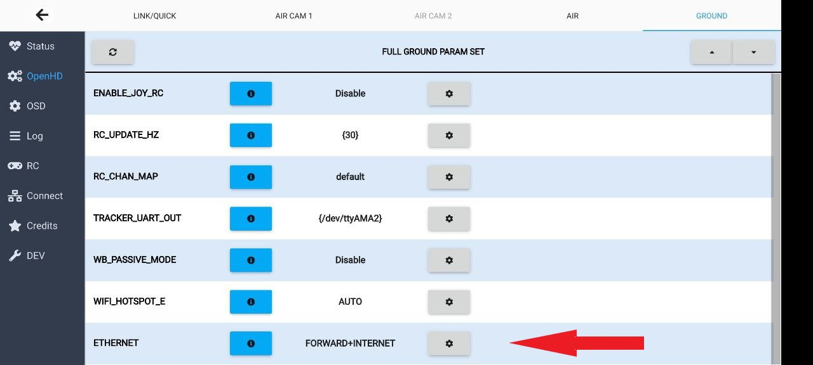
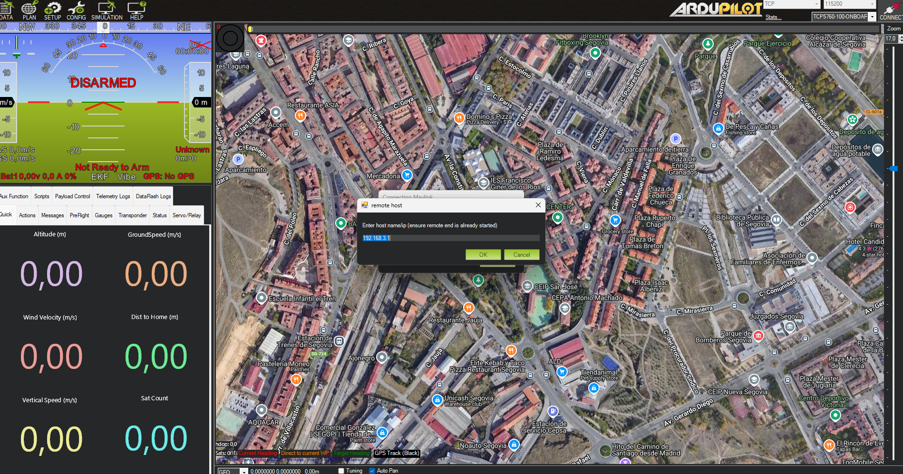
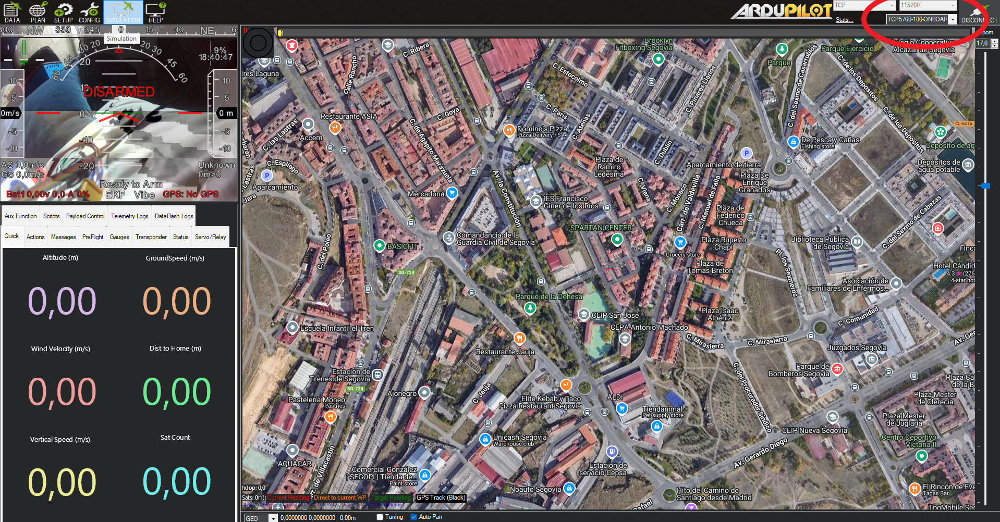
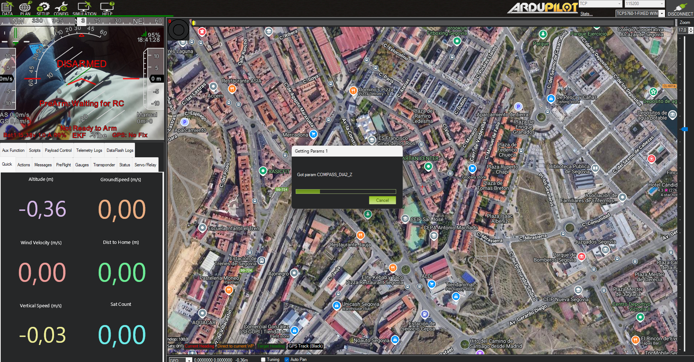
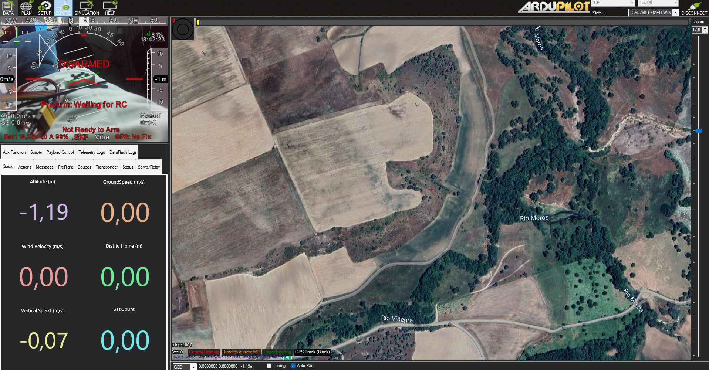

# Mission Planner

## Introduction

Mission Planner \(MP\) is a Ground Control Station \(GCS\) software for all types of vehicles based upon the [ArduPilot](http://ardupilot.org/) open source autopilot system, e.g. [ArduPlane](http://ardupilot.org/plane/index.html), [ArduCopter](http://ardupilot.org/copter/index.html), [ArduRover](http://ardupilot.org/rover/index.html) or newest to the family [ArduSub](https://www.ardusub.com/). It is compatible with Windows only. It can be used as a configuration utility or as a dynamic control supplement for your autonomous vehicle. Here are just a few things you can do with MP:

* Flash firmware \(the software\) into the autopilot board \(i.e. Pixhawk series\) that controls your vehicle.
* Setup, configure, and tune your vehicle for optimum performance.
* Plan, save and load autonomous missions into the autopilot with simple point-and-click way-point entry on Google or other maps.
* Download and analyze mission logs created by the autopilot.
* Interface with a PC flight simulator to create a full hardware-in-the-loop UAV simulator.
* Monitor your vehicle’s status while in operation.
* Record telemetry logs which contain much more information than the on-board autopilot logs.
* View and analyze the telemetry logs.
* Operate your vehicle in FPV \(first person view\)

## Setting up bi-directional telemetry with OpenHD.
The first thing apart of obviusly download Mission planner you need to download a third-party software named Gstreamer [Gstreamer](https://gstreamer.freedesktop.org/).

In order to use MP in conjunction with OpenHD it is necessary to forward all telemetry to the PC, you can do it over WIFI or over Ethernet. We recommend to use ETHERNET over WIFI because the hostpot wifi on the RPI is very very noisy and can interfere with the main link between air and ground. All of the following settings are common to WIFI and ETHERNET.

> :warning: **Important Note:** Here´s what can happen if you use wifi as a connection method for external telemetry during flight.


Now, Let's gets get started:

1. The Wifi hostpot is by default ON when disarm and OFF when arm because the possible interference, you can change it using the sidebar, if you want to use Ethernet just connect the cable
2. Next power on your Air- and GroundPi
3. Enter in the Ground tab and here change the settings "Ethernet" from disable to Hostpot or forward+internet, the last one is very handy to give internet to the pc from your phone 

4. Reboot ground unit, once you have done this settings you can leave it ON it doesnt interfere with anything
5. Open Mission Planner and select as method of connection TCP
6. Once selected a few windows will pop up, in the first one you should enter the IP (192.168.3.1)
   

7. In the next window you have to introduce the port (5760)

8. Now you should have video but not telemetry, to solve it you need to press in the drop-down and change it from "onboard" to "Fixed wing"

9. Everything should be ready and working

