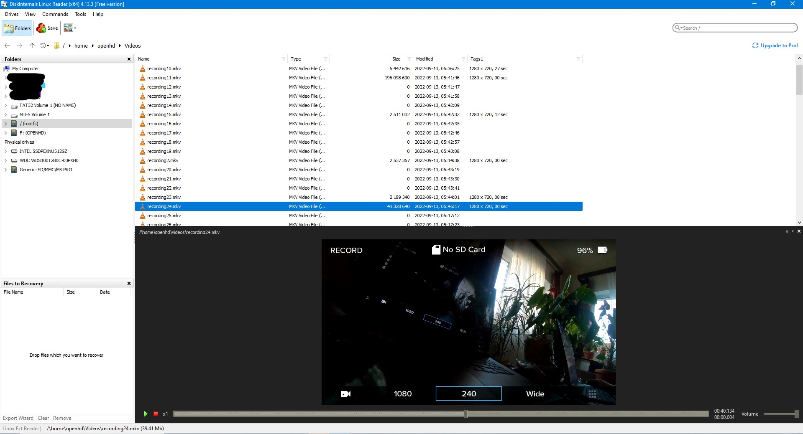

# Record video

You can record your flight locally on your air unit with close to none performance hit. The recorded video uses the same bitrate like the video transmitted over the link, but is free of any breakups from packet loss (since it is recorded locally on your air unit, not your ground unit


To use this feature, \
1\) Enable video recording for a connected camera - in QOpenHD, go to  OpenHD Settings / Camera and via the param editor, set

```
V_AIR_RECORDING=Enabled 
```

Now openhd will automatically start recording your camera's video during operation\
\
2\) To download / view the recordings\
Option a: After a flight, take the SD card out of your air unit and put it into a card reader\
You can find the recordings under §SD\_CARD$/home/openhd/videos\
\
If you are using windows, you might have to use a tool like "diskinternals Linux reader":\
\
\
\
Option b: After a flight, enable "wifi hotspot" on your air pi (requires pi with integrated wifi)\
Connect phone or pc to pi's wifi, open a browser in your pc/phone, type in pi's address, you'll find it's web interface, you'll see a tab called Files, open it, there are the video files.\
\
\
