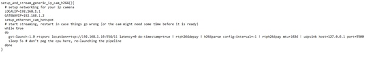

# IP cameras

<!-- LEGACY DOCUMENTATION NOTICE -->
> ⚠️ **This documentation is outdated!** A current version is available at [openhdfpv.org](https://openhdfpv.org)
> 
> [📖 **View Updated Version of This Page** →](https://openhdfpv.org)

---

> :warning: **Important Note:** IP camera support has limitations and should be chosen carefully, considering its disadvantages.

IP cameras cannot be automatically detected, as they lack a common protocol like USB cameras. They also require custom scripting for integration and lack support for bitrate adjustments, making them quite bad for long range sytems. They also don't support adjusting the keyframe interval, which can black out your video for several seconds when having any interference.

To implement IP cameras, you can utilize the custom_unmanaged_camera.sh script, which needs to be activated through the [hardware.conf](../hardware.conf.md) configuration.

For advanced users, we have implemented "scripting support," which allows for custom camera pipelines, IP cameras, and general debugging.

Currently, there are several example pipelines available for:

| Camera                |
| --------------------- |
| OpenIPC cameras       |
| General IP cameras    |
| Seek Thermal cameras  |

This feature requires disabling auto-detection and needs manual activation in the `hardware.conf` configuration file.

# OpenHD IP Camera instructions

**Step 1**  
Before setting things in OpenHD, first configure the following things in the IP camera:

Setup static IP for the camera.
Configure a H.264 rtsp stream and test it in a program like VLC.

After that, you are ready to start with OpenHD configuration.

**Step 2** 

To configure the camera, you need to configure a script that starts the network connection to the camera and then starts the Gtreamer pipeline. Over this you also need to create a service that executes this script when the air sbc is turned on.

To configure the pipeline to the camera you need to modify the script “custom_unmanaged_camera_old.sh” in air sbc. Rename it to “custom_unmanaged_camera.sh”. After that, open the script and you will find different examples of configuration for connection to different cameras. Copy “setup_and_stream_ip_cam_siyi_h264” configuration and rename it to a different name. Now to configure “LOCALIP” and “GATEWAYIP” with the same first 3 numbers as your IP camera IP and with the last number being different in all 3 cases. Then you need to change the stream link in the Gstreamer pipeline command with the correct one of your camera. The configuration should look like this:

**Step 3** 

At the bottom of the script, comment all the configurations and put the name of the new one you have created and save the file. Finally, open a terminal and execute the following command “sudo chmod +x PATH/custom_unmanaged_camera.sh” with the correct path to the file.

**Step 4** 

To create the service that activates the script you must follow the next steps. Download the following file (https://github.com/OpenHD/OpenHD/blob/2.5-evo-rapha/systemd/custom_unmanaged_camera.service) that isn't included in version 2.6.0 of OpenHD. You need to copy that file in /boot/etc/systemd/system/ but you need to do it using the terminal with the command “sudo cp ORIGINPATH/custom_unmanaged_camera.service DESTINATIONPATH/etc/systemd/system/” where both “originpath” and “destinationpath” are correct paths. After that you are ready to turn on air sbc and follow next steps. Connect a monitor and a keyboard to air sbc and exit from kiosk mode using Ctrl+C. After that, activate the new service using “sudo systemctl enable custom_unmanaged_camera” command. Following that, start the service with “sudo systemctl start custom_unmanaged_camera” command and then confirm that it is active with “sudo systemctl status custom_unmanaged_camera” command. Reboot air sbc with “sudo reboot” and it should be ready.

**Step 5** 

To configure the visualization in QOpenHD go to the menu and setup the camera as DEV=>External.

# Warning

> **Note 1**: The custom unmanaged camera service requires careful testing and doesn't provide automatic functionality right away. It is intended for advanced users and developers who understand its intricacies.

We encourage you to experiment with this feature, but please be aware that it's meant for users with a good understanding of camera pipelines and system integration.

IP-Cameras are not specifically designed for low latency, and many of them have latency upwards of 500ms+, but there are specific cameras available for purchase that have reasonable latency closer to 100-200ms. Remember this latency will be added to the "normal" latency your system has. So most IP-Camera Setups will have 300-600ms latency. It is not recommended to use an IP-Camera as primary camera.
That means the main reason to choose an IP-Camera is to enable some custom features normal Cameras do not support.
