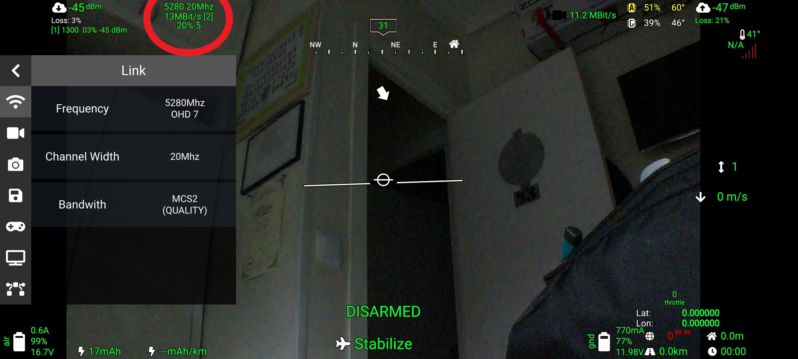
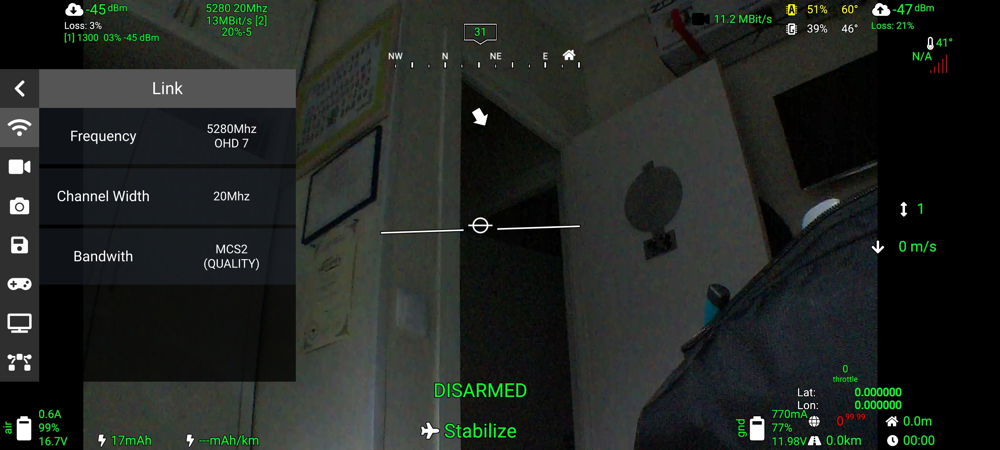
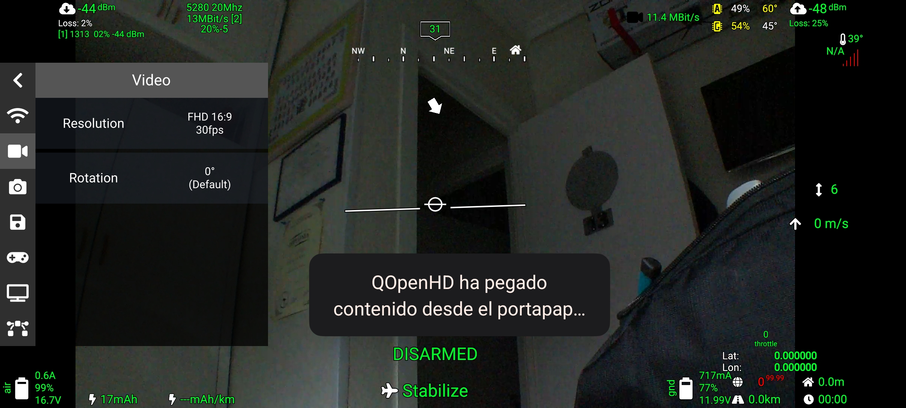
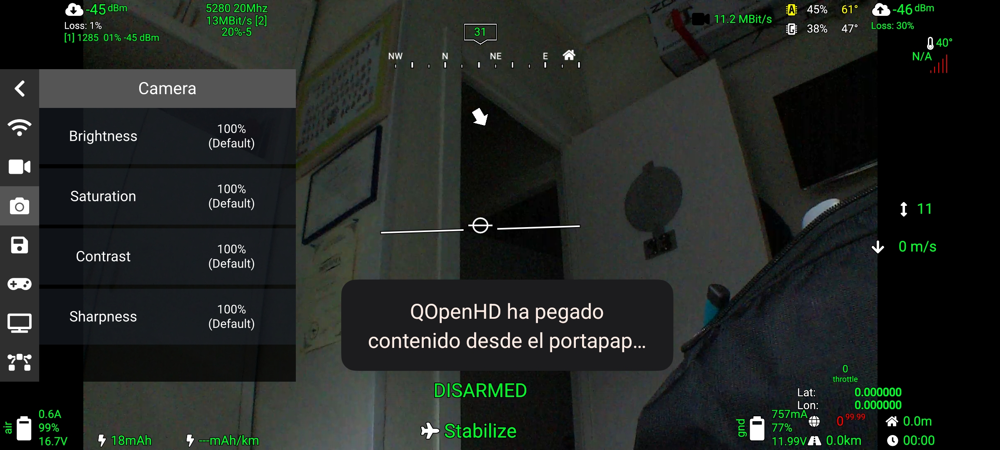

# First Time Setup

<!-- LEGACY DOCUMENTATION NOTICE -->
> ⚠️ **This documentation is outdated!** A current version is available at [openhdfpv.org](https://openhdfpv.org)
> 
> [📖 **View Updated Version of This Page** →](https://openhdfpv.org)

---

When a project reaches a certain stage, the amount of options to choose from can get pretty overwhelming. This section of the documentation is intended to help guide newcomers to the project towards their first functional OpenHD implementation.


If you have a pre-existing hardware requirement that is not met in this guide, it is still a good idea to follow the guide and make sure you have this, the simplest setup, working before venturing into the more complex setups. Every setup, no matter how complex uses the elements in this guide at it's base.


## Sourcing hardware

Assuming you are starting with nothing, we recommend you get the following Hardware:

### Ground

* A regular Laptop with disabled SecureBoot
* A 8812AU, 8812BU, 8811AU or 8814AU  WiFi Card (See [WiFi Adapters](wifi-adapters.md))
* A fast USB stick, to write the OpenHD USB Image on

### Air cheap

Pi Zero 1 is not supported you need the version 2 !


* A Raspberry Pi Zero 2:
* High Quality BEC's, one for the Wifi-Adapter and one for the Raspberry. (See Wiring -> Power)
* A  ([supported Camera](../hardware/cameras/raspberry-cameras.md)) and the required cable (keep in mind, the Pi Zero uses a 22 Pin type B csi cable)
* A soldering iron and required disposables.
* Various lengths of connection wires.

### Air more sophisticated (better for advanced features/dual Camera)
* A Raspberry CM4 with EMMC with:
  * An [Ochin CM4 carrier](ochin.md) board
  * We recommend fitting a cooler to the CM4, because it really can get hot.
  * A 8812AU, 8812BU, 8811AU or 8814AU WiFi Card (See [WiFi Adapters](wifi-adapters.md))
* A  ([supported Camera](../hardware/cameras/raspberry-cameras.md)) and the required cable (keep in mind, the Ochin uses a 22 Pin type B csi cable)
* A soldering iron and required disposables for creating the connections to the Wifi-Card

## Step-by-step

Now that you have your prerequisite Hardware, we can get down to business.

### Step 1: Considerations about X86

When using X86 the genaral rule of thumb is "the more potent"/newer the device is, the lower the latency should be.
Keep in mind, that you have enough battery or an external charging device.
Its also recommended to use a device with a good screen (high brightness) to have a pleasent experience

### Step 2: Connecting the WiFi Adapter to the AIR

Since we use very powerfull WiFi-Cards and most SBC's have limited USB-Output-Power, we need a dedicated BEC for that Card's. In Addition to that it's mandatory to solder the wifi card to the SBC because on the Air-SBC vibrations and movement in general will result in connection problems, that's why we recommend to remove the USB-Connector or at least solder to the USB-Connector. If you need help with that look in our forums, there are some extensive guides how to do it nicely. Also writing in the Telegram or Discord Chat can help you.
Is recommended to visit the wiring section to see how to connect everything
([Wiring](../hardware/wiring.md))

### Step 4: Flashing the Ground SBC for the first time

Please refer to the ([Installation Guide](../installation-guide.md)) since its quite similar

The flasing process can be much longer than on RPI


### Step 5: Booting your Ground

Please make sure SecureBoot is disabled and set up your BIOS(UEFI) to boot from USB.
Everything else is beeing taken care of. If QOpenHD doesn't start automatically, please execute OpenHD and QOpenHD which are linked to your Desktop.

(The boot can take several minutes, depending on your usb-sticks speed)

### Step 6: Flashing the Ochin SBC for the first time

If you're not using the Ochin board,you can jump to the next step. If you're using the Ochin, you first need to install your CM4 into the Ochin board and flash it. The Ochin board requires external power even when the usb-c is connected. To enter the "flash-mode" push the Button while connecting power. Now you can continue with the normal setup shown in this Video. And when it comes to flashing jump to the next Step



  Keep in mind, flashing is very slow, because some limitations of the RPi-Foundation. Do not disconnect while flashing, it can brick your device.

### Step 6.5: Flashing the Air SBC

Please refer to the ([Installation Guide](../installation-guide.md)) 

### Step 7: Starting the Air SBC

The first boot will take several minutes, because initial configs and setups are executed. The SBC will reboot multiple times. OpenHD will automatically start to transmit Video, if everything is correct.

### Problem 1: Not having image but you have connection

To know if you at least have connection you can go to the tab "status" and if you can see both air and ground "live" both are connected and we can move on

If you haven't configured your camera correctly you'll see a black image that says "rebooting camera", in this case look into the "AIR CAM 1" Menu in QOpenHD (the OpenHD Logo opens the Menu) and select the correct camera overlay in the CAMERA_TYPE setting. After this your SBC will reboot and start transmitting video.

### Problem 2: Having image but no telemetry

If you dont have telemetry coming from your FC to the ground usually its an issue of wiring (refer to ([Wiring](../hardware/wiring.md)) to know how to connect the FC to the air, if not fixed it can be and issue with the baud rate of the uart (remember that needs to be the same) you can change it on OpenHD or on your FC, to change it on OpenHD you need to go to the "AIR" tab and then into the "FC_UART_BAUD"

([Installation Guide](../installation-guide.md)) 

### Step 8: Setting up the link

OpenHD has a enormous amount of settings but the most important ones are going to be explained here below

The first thing that almost everyone needs to set up its the power of the cards, the frecuency and STBC and LDPC, you can do all of it in a single tab located in "OPENHD" and "LINK/QUICK"
Also you have the options "SCAN" and "ANALYZE" the first one its very handy to find the  frequency where your UAV is transmittings and the second one analyze all the wifi spectrum to find how pulluted are the wifi frequencies (it takes a while)

To change the power please refer to the ([TX POWER](../software-setup/tx-power.md)) 
STBC and LDPC are two important parameters that needs to be turn on on both air and ground to improve wifi coverage and range by using the two antennas to receive and send at the same time, by default both are off because you CANT turn them on in rtl8811au because it only has one antenna

Now we need to introduce is the "SIDEBAR" that opens in the side of your main screen to allow you to change important settings without lossing eye contact with the video
To open it just click on the red circle

In this sidebar you can finish your configuration and also change settings while flying, you can move around it with the touch or with a mouse 
In this firts tab called "LINK" you can select your wifi frequency (you cant change it while armed), channel width and bandwith

In this tab called "VIDEO" you can select your resolution for the link and also rotate the camera if you wish (the resolution that you set here is also the resolution that is going to be recorded)

In the thrid tab called "CAMERA" you can change settings of the camera itself like saturation, contrast, sharpness and brightness

In the fourth tab called "AIR RECORDING" you can change settings regarding the air recording, in EVO we use air recording instead of ground recording like in 2.0 to improve the experience of the recording by removing the possible interference that can be present in the link
By deafult is set to OFF but you can set it up ON or AUTO, in AUTO the system is going to start recording at the moment you arm the UAV

Other very important screen is the one where you can see statistics of the link, to open it click on the red circle


If you have any issues now, please don't hesitate and write in our Chats, so we can help you get everything working correctly.

