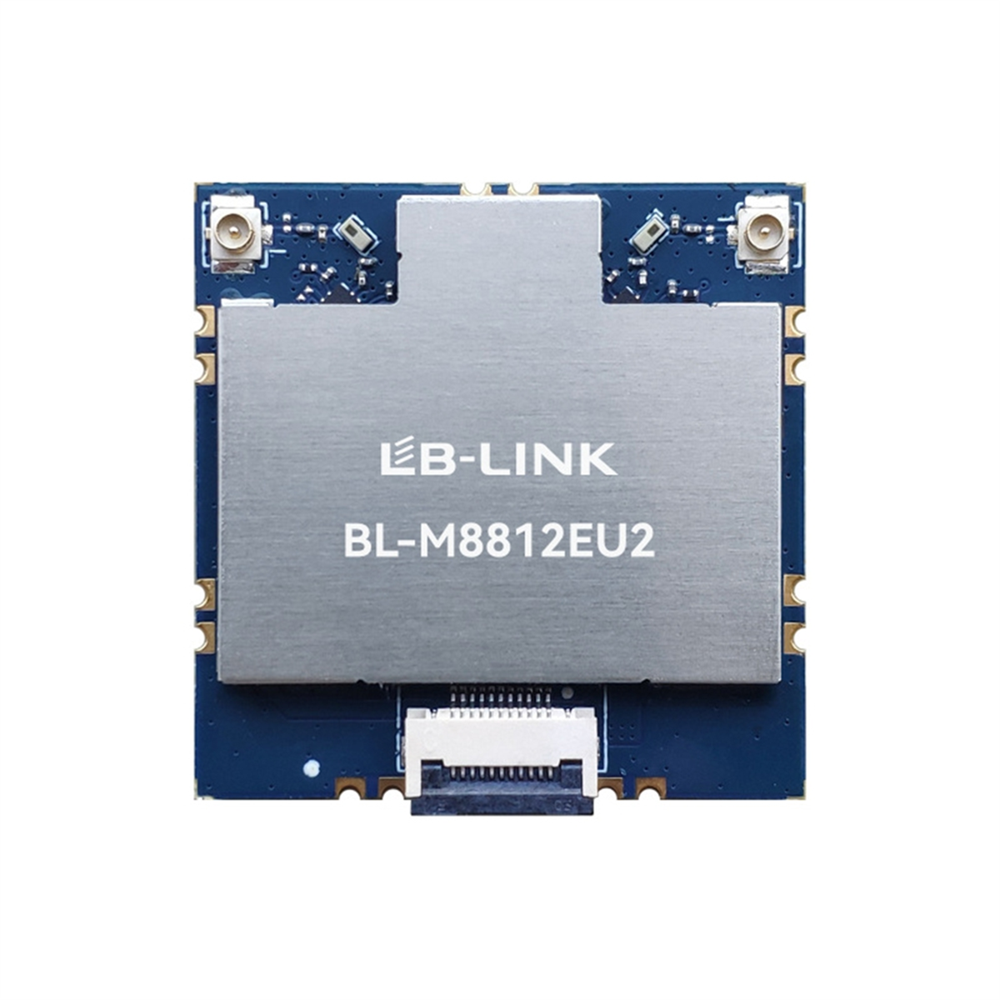
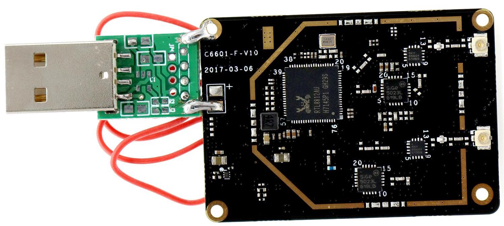

# WiFi Adapters

<!-- LEGACY DOCUMENTATION NOTICE -->
> ⚠️ **This documentation is outdated!** A current version is available at [openhdfpv.org](https://openhdfpv.org)
> 
> [📖 **View Updated Version of This Page** →](https://openhdfpv.org)

---

If you are new to OpenHD and not familiar with all the advantages and disadvantages of different WiFi cards, consider getting 2x ASUS USB-AC56 or a similar high-quality adapter using the RTL8812AU chipset. Pay close attention to the version number of the WiFi adapter, as manufacturers often use different chipsets with varying version numbers. Each letter and number in the version matters; they are not the same.

When choosing between 2.4GHz and 5.8GHz, keep in mind that while 2.4GHz offers better penetration, it is more susceptible to common sources of interference, and finding a clean channel on 2.4GHz can be challenging. 5.8GHz also allows you to use your existing 2.4GHz RC transmitters. For these reasons, many users currently prefer 5.8GHz for OpenHD.

## RX Diversity

You can achieve RX diversity by using either a WiFi card with multiple antennas or multiple WiFi cards on your ground station. However, it's easy to make mistakes with improper wiring or using the wrong antennas when using more than one RX card. Therefore, we do not recommend using more than one card for new users. Mixing cards with different chipsets or from different vendors, even if they support the same frequency, is also not recommended.

## Supported Chipsets (Since Version 2.6.3)

- RTL8812AU, RTL8814AU, RTL8811AU
- RTL8812BU
- RTL8812EU

## Recommended WiFi Dongles

| Name               | Band       | TX Power    | Chip      | Antennas                     |
| :----------------- | :--------- | :-------    | :-------- | :--------------------------- |
| ALFA AWUS036ACH    | 5.8 - 2.4* | 500mW       | RTL8812AU | 2x RP-SMA                    |
| BLM8812EU          | 5.8        | +800mW      | RTL8812EU | 2x u.fl                      |
| ASUS USB-AC56      | 5.8 - 2.4* | 500mW       | RTL8812AU | 1x RP-SMA 1x MS156           |
| "Taobao Card"      | 5.8 - 2.4* | 500mW       | RTL8812AU | 2x u.fl                      |
| ALFA AWUS1900      | 5.8 - 2.4* | 500mW       | RTL8814AU | 4x RP-SMA                    |
| Tenda U12          | 5.8 - 2.4* | 60mW        | RTL8812AU | 2x MS156 2x internal         |
| Cudy AC 1300       | 5.8        | <50mW       | RTL8812BU | internal                     |
| Aigital AC1200     | 5.8        | ? low power | RTL8812BU | internal                     |
| COMFAST 1300Mbps   | 5.8        | ? low power | RTL8812BU | internal                     |
| D-Link DWA-182     | 5.8 - 2.4* | 70mW        | RTL8812BU | 2x internal                  |
| TP-LINK T3U Plus   | 5.8 - 2.4* | 40mW        | RTL8812BU | 2x u.fl 1x RP-SMA            |
| TP-Link T3U        | 5.8 - 2.4* | 80mW        | RTL8812BU | 2x MS156 2x internal         |

*We recommend using this chipset in 5.8GHz mode.

Please note that this list includes tested devices, but there are many more supported devices.

## Additional WiFi Devices without STBC/LDPC
| Name               | Band       | TX Power    | Chip      | Antennas                     |
| :----------------- | :--------- | :-------    | :-------- | :--------------------------- |
| Netgear A6100      | 5.8 - 2.4* | 50mW        | RTL8811AU | 1x internal                  |

Since with OpenHD 2.5 we started to utilize the Link a lot more efficient and allow settings like 40mhz and default to normal FPV/DJI/HDZERO/Walksnail.... frequencies, which doesn't work at all with Atheros chipsets, so we decided to drop support for them.

## BLM8812EU

This chip is the most recent wifi chip available and one of the most potent ones, it has one of the best cost/performance relations.

> :warning: **Important Note:** This wifi chip/module doesnt have FCC and CE certification to use or buy in EU so if you do that its within your own responsability .

[Store link](https://es.aliexpress.com/item/1005007386940533.html?cn=e-c&af=%7B%22c%22%3A%228GUwguoP9hrel0fz1693862233%22%7D&aff_fcid=c17dec0d6db649df998a251cf12683a0-1741439858818-03617-_ol0Mdtc&aff_fsk=_ol0Mdtc&aff_platform=api-new-link-generate&sk=_ol0Mdtc&aff_trace_key=c17dec0d6db649df998a251cf12683a0-1741439858818-03617-_ol0Mdtc&terminal_id=b59d440c4b0e4e599065b35fb9f515c2&afSmartRedirect=y)

## ASUS AC56

The ASUS AC56 adapter is currently the most popular choice for OpenHD. Its small size makes it easy to fit into many builds, it uses 5.8GHz, and it is widely available. While the retail price can be high, it is often available used or on sale for $30 or less. It has one internal antenna, and the second antenna is optional, connecting with RP-SMA.

- [FCC info](https://fccid.io/MSQ-USBAC56)
- [WikiDevi](https://deviwiki.com/wiki/ASUS_USB-AC56)
- [Modification Page](https://forum.openhdfpv.org/t/asus-usb-ac56-wiring-antennas-etc/103)

## Taobao Card

[Store link](https://a.aliexpress.com/_rIjofM)

The Taobao Card is a generic RTL8812AU card sold on Taobao, from which it gets its name. It is widely used and known to work well, but it tends to get hot. The reported power output is 500mW. This card requires soldered wiring, or the USB connection may disconnect before or even during flight. It supports 2x u.fl antenna connectors.

## Finding Alternatives

For affordable alternatives, check out computer stores and consider Aliexpress. Exercise caution, as some cards may have questionable quality. Generally, high-quality or brand-name modules with RTL8812AU chipsets perform best.

To discover more about WiFi sticks and modules offered online, look for product numbers, chipsets, or FCC IDs. Search for high-resolution internal photos of the cards to identify the chipset and amplifiers used. You can also use helpful websites like:

- [FCC ID](https://fccid.io/) (FCC documents with internal photos)
- [WikiDevi](https://wikidevi.com/wiki/) (General information and sometimes photos)

When you find photos, search for the amplifier numbers to find datasheets that provide rough estimates of the expected output power.

Please consider reporting your findings if you've tried a WiFi card that is not listed here.

