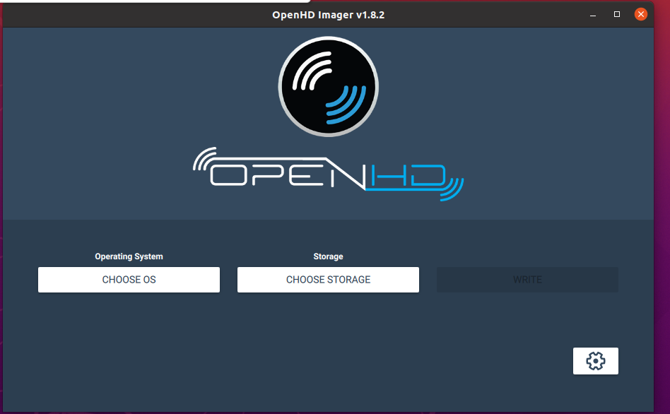
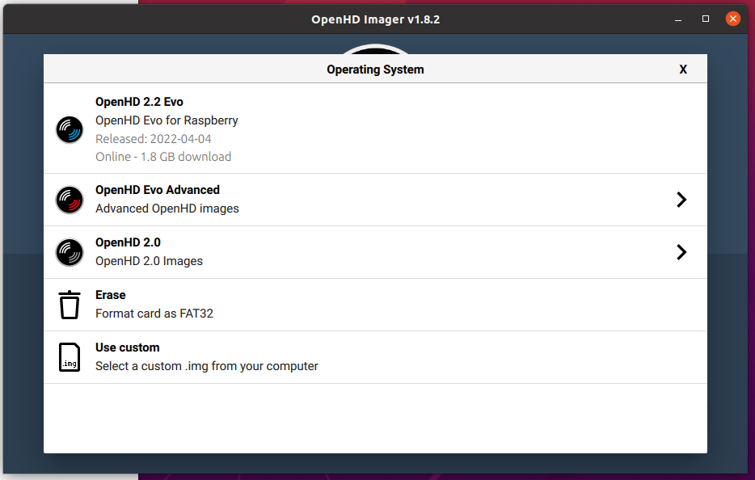

# Flashing Your Air and Ground Units with OpenHD Firmware

## Requirements:

1. A Windows or Linux PC (Alternatively, see "Manual Install" below).
2. 
    a) An SD card reader and a high-quality SD card with a minimum capacity of 16GB (Raspberry Pi only needs 8GB).

    b) A high-quality USB cable (required for hardware with internal memory, e.g., Ochin & CM4 with eMMC).

# Installation Guide

**Step 1:** 
Download and install the latest OpenHD ImageWriter, which is based on the Raspberry Pi Imager, from [https://openhdfpv.org/downloads/](https://openhdfpv.org/downloads/) and [Backup Mirror](downloads.md).

**Step 1.1 (Only for CM4 with eMMC):** 
If you're using the Ochin,or any other CM4 carrier you first need to install your CM4 into the carrier board and flash it. Some boards requires external power even when the usb-c is connected. To enter the "flash-mode" push the Button while connecting power. Now you can continue with the normal setup shown in this Video. And when it comes to flashing jump to the next Step



  Keep in mind, flashing is very slow, because some limitations of the RPi-Foundation. Do not disconnect while flashing, it can brick your device.

**Step 2:**
Open the image writer and select the latest OpenHD release from the drop-down menu. The image writer will automatically download the selected image. Alternatively, you can manually download the image and flash it using the "Custom image" selector. Ensure you unzip the image externally first and then select the .img file (not the .zip file).

**Step 4:**
Insert your SD card into the card reader, and select it from the "Choose storage" option. If you are using a CM4, it will appear as an SD card.

**Step 5:**
Click on "Settings" in the lower-right corner and choose either "Air" or "Ground," depending on whether you want to flash an air or ground image. This step is essential for a functional OpenHD setup; you need to flash one Air unit (select air) and one Ground unit (select ground).

**Step 6:**
Flash your image by clicking on "Write." This process may take some time.

### Manual Install:

You can always flash OpenHD images using the flashing tool of your choice. In this case, you must manually specify whether you want to boot as an air or ground unit after flashing. For an air unit, create a file called "air.txt" under `/boot/OpenHD/`. For a ground unit, create a file called "ground.txt" under `/boot/OpenHD/`.

**Note:** Filenames are case-sensitive. If you wish to switch from air to ground, it is recommended to reflash your image and then create the appropriate "air.txt" or "ground.txt" file.
