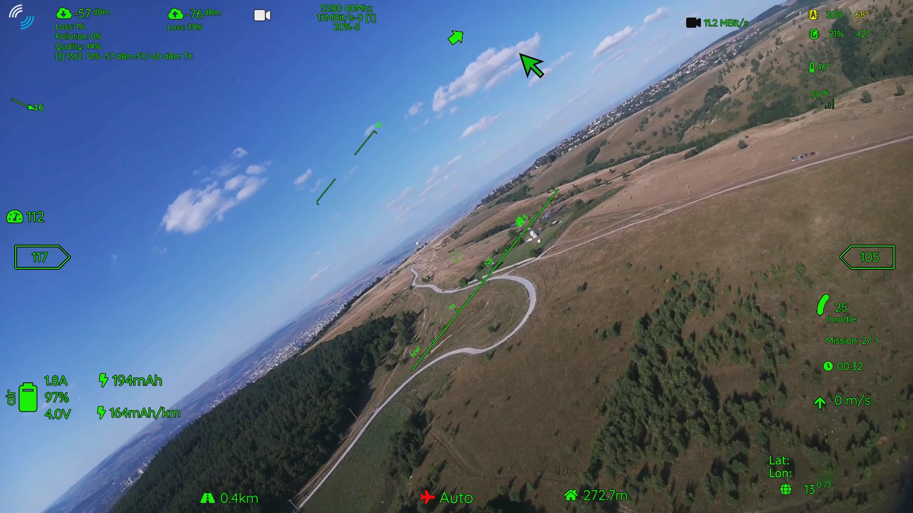
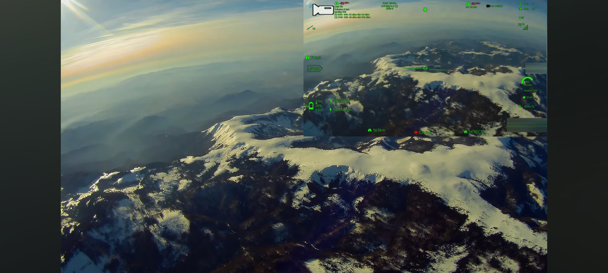

# ⚠️ DOCUMENTATION MOVED - READ THIS FIRST!

> ## 🔄 **This documentation is END OF LIFE and no longer maintained**
> 
> **The official OpenHD documentation has moved to:**  
> **👉 [https://openhdfpv.org](https://openhdfpv.org) 👈**
>
> Please use the new documentation for:
> - ✅ Up-to-date information
> - ✅ Latest installation guides
> - ✅ Modern troubleshooting
> - ✅ Current hardware support
>
> **[📖 Read Full EOL Notice](EOL_NOTICE.md)**

---

# Introduction (LEGACY - NOT MAINTAINED)

OpenHD is a suite of software designed for long-range video transmission, telemetry, and RC control. While we originally designed it with hobbyist drones in mind, it can be adapted to a wide range of other applications as well.



## What OpenHD Can Do

Our suite can transmit:

* High definition video (with multiple cameras)
* Two-way UAV telemetry
* Two-way OpenHD telemetry (General settings, range-adjustments, channel-changes, wifi-modulation,...)
* RC control signals

All of these signals can be sent over a single transmission channel and telemetry is using MAVlink to ensure high compatibility and stability.

## OpenHD digital fpv world record 55km

[Leaderboard](https://sites.google.com/view/wbb-longrange/fixed-wing)

## How does the OpenHD link (wifibroadcast) work

OpenHD employs readily available Wi-Fi adapters, although not in the standard manner commonly associated with everyday Wi-Fi usage. To ensure low-latency and long-distance transmissions, we configure these adapters to function akin to analog video transmission hardware. This innovative protocol, inspired by [befinitiv](https://befinitiv.wordpress.com/wifibroadcast-analog-like-transmission-of-live-video-data/), has been reimplemented by OpenHD for optimized performance.

The configuration empowers OpenHD to transmit high-quality video and other signals across significant distances while maintaining minimal latency.

## QOpenHD App

We offer a multi-platform [app](https://github.com/OpenHD/QOpenHD/releases) with a customizable on-screen display (OSD) for live video. The app is designed to work seamlessly with our suite, and allows you to easily view and control your OpenHD transmission.

## Support and Further Reading

If you need help or want to learn more, we offer several resources:

* [OpenHD Forum](https://forum.openhdfpv.org/)
* Public [Telegram](https://t.me/OpenHD\_User) and [Discord](https://discord.gg/P9kXs9N2RP) groups for lots of immediate interaction
* Please document problems on [Github](https://github.com/OpenHD/OpenHD/issues)
* First intro to Open.HD from CurryKitten on [Youtube](https://www.youtube.com/playlist?list=PL7WaECFssECJWfTc0vKYTfUdH5y8UgdI9)

> :warning: **Important Note:** Support for OpenHD 2.0.x is no longer provided.

> :warning: **Important Note:** If you have a problem with a specific version of OpenHD, please check the name of the image you used to burn your SD cards and provide it to us in Telegram so we can help narrow down the cause and find a solution.
