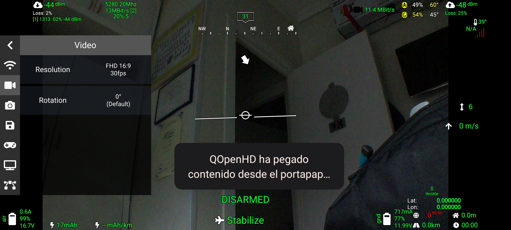


Settings do not work on unmanaged Cameras!


# Camera Settings in OpenHD Evo

<!-- LEGACY DOCUMENTATION NOTICE -->
> ⚠️ **This documentation is outdated!** A current version is available at [openhdfpv.org](https://openhdfpv.org)
> 
> [📖 **View Updated Version of This Page** →](https://openhdfpv.org)

---

OpenHD Evo provides you with the flexibility to adjust camera settings, such as resolution and framerate, in real-time without the need for a system reboot. These settings allow you to customize your video stream to meet your specific needs.

# Picture Settings

For Libcamera and Raspivid we have a lot of Picture settings to optimize your experience. These are located in the Camera Tab or in the sidebar

**Example:**

**Note**: While OpenHD Evo includes some user input validation, certain parameters cannot be fully validated due to the diverse range of hardware and configurations. Therefore, it is essential to monitor your video stream when making changes to settings like resolution and framerate.

If your video stream suddenly stops working or experiences issues, follow these steps:

1. **Check the Log in QOpenHD**: Look for error messages, particularly those mentioning "restarting camera, check your parameters/connection." This may indicate that you've selected an unsupported combination of settings.

2. **Review and Adjust Settings**: If you encounter errors, review your camera settings. Ensure that you've selected a supported combination of resolution and framerate for your specific hardware. For example, setting 720p resolution at 120fps on a Raspberry Pi may lead to issues.

By selecting a supported video resolution and framerate, such as 720p at 30fps on a Raspberry Pi, you can likely recover from errors and maintain a stable video stream.

Customizing camera settings in OpenHD Evo empowers you to optimize your video feed for various scenarios and requirements.
