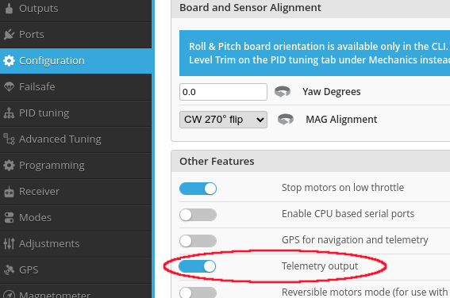
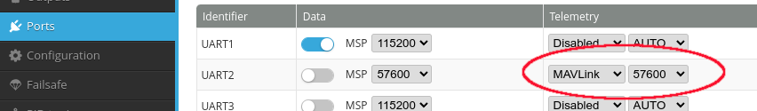

# INAV: Intelligent Navigation System for Aerial Vehicles

## General Information

INAV, short for Intelligent Navigation System for Aerial Vehicles, is an open-source flight control software designed to navigate and stabilize fixed-wing and multirotor unmanned aerial vehicles (UAVs), including drones and RC airplanes. Developed and maintained by a community of hobbyists and enthusiasts, INAV has gained popularity within the DIY drone and RC aircraft community.

OpenHD recommends INAV due to its user-friendly configuration approach, which makes it suitable for beginners, while also offering extensive flexibility for experts.

## Connecting INAV to OpenHD

To establish a connection between INAV and OpenHD, there are different methods available:

1. **Recommended Method**: Utilize the hardware UART from your air unit (e.g., Raspberry Pi) along with one hardware UART from your flight controller.
2. **Not Recommended**: Use a USB cable on a flight controller that supports this approach (e.g., PX4).
3. **Not Recommended**: Utilize a USB-UART programmer.

### 1) Enabling UART in OpenHD

By default, UART telemetry is disabled in OpenHD <2.5 . To enable it, navigate to the AIR(TMP) Settings registry using QOpenHD and select serial0. Be sure to set the correct baud rate that matches your flight controller.
If you use 2.5 or higher versions telemetry is enabled from the start on Serial0.

### 2) Wiring

Connect the TX pin of the serial port on your flight controller to the RX pin on the Raspberry Pi. Important: The Raspberry Pi uses 3.3V logic level on its serial ports, so ensure that your flight controller also operates at 3.3V. Connecting a 5V logic level may damage the Raspberry Pi's serial port. Refer to the [Pinout](https://learn.microsoft.com/de-de/windows/iot-core/media/pinmappingsrpi/rp2_pinout.png) diagram for pinout details.

## Configuration of INAV

Configuring INAV is straightforward:

1. In the Configuration tab of INAV Configurator, turn telemetry on. Click Save & Reboot.

2. In the Ports tab of INAV Configurator, select MAVLink telemetry and set the baud rate for the port you used on the
flight controller.

3. Note that INAV reports its home position differently than the Mavlink documentation. Due to this, you may wish to enable the `enable_dirty_inav_hacks` option in OpenHD.
