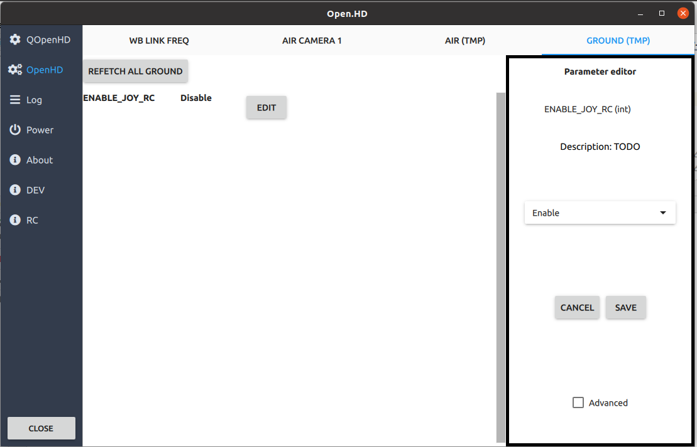
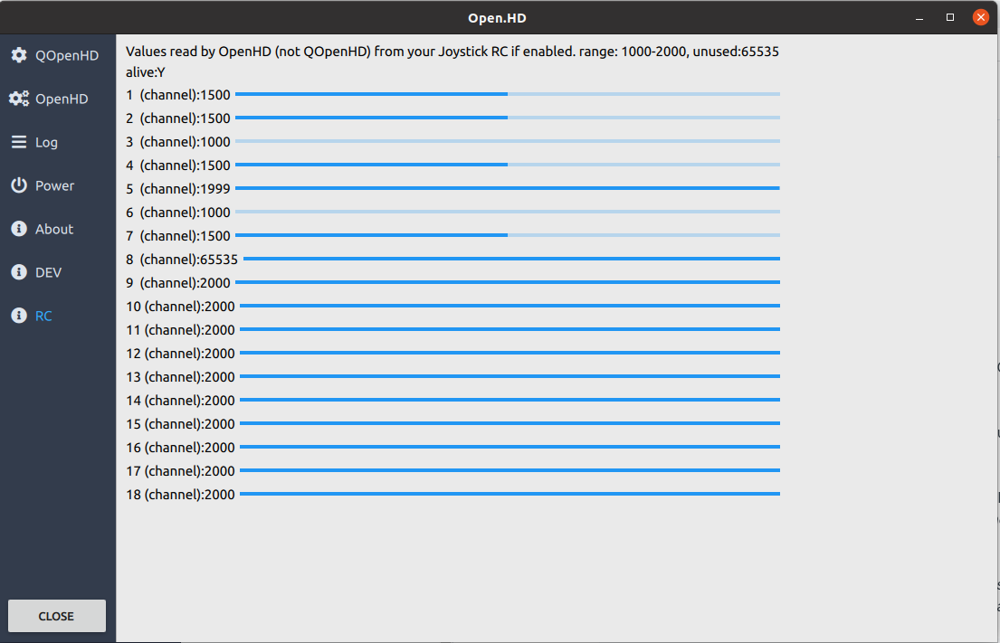

# Joystick RC Control

**WARNING**: This feature is currently in beta. Please exercise caution and perform thorough testing.

OpenHD offers support for Remote Control (RC) input over MAVLINK, allowing you to connect a joystick (such as your RC controller in joystick mode) to your ground station via USB. This enables you to control your drone directly through the OpenHD wifibroadcast link.

**NOTE**: It's important to be aware that WiFi may not be ideal for transmitting many small RC packets. For the best experience, it's recommended to use a standard RC link operating on a different frequency than your OpenHD wifibroadcast link. For example, you can use 2.4GHz ELRS for RC control and 5.8GHz for wifibroadcast.

**NOTE 2**: RC over MAVLINK is supported by INAV, Ardupilot, and Pixhawk but is not supported on Betaflight.

**NOTE 3**: RC data is transmitted over the same UART telemetry connection between OpenHD and your Flight Controller (FC) as required for MAVLINK telemetry.

## Setup Steps

### Step 1: Enable Joystick on Ground Unit

1. In QOpenHD, navigate to the OpenHD settings page, specifically the GROUND (TMP) section.
2. Set `ENABLE_JOY_RC` to true.
3. Reboot your ground station.

### Step 2: Connect Your Joystick

Connect your joystick to the ground station. For RC controllers, connect via USB and ensure you've selected Joystick mode.

### Step 3: Verify Joystick Input

Confirm that OpenHD detects and properly reads values from your joystick. In the QOpenHD interface, navigate to the RC section to view the current readouts. For example, if you're using a TX16s controller connected with AETR and 18 channels, you should see the input values.

### Step 4: Validate Failsafe

OpenHD continuously sends RC joystick data as long as `JOY_RC` is enabled, and a joystick is connected. It will stop sending data if the joystick is disconnected, triggering a failsafe on supported Flight Controllers (TODO: validate).

### Step 5: Adjust Update Rate

You can adjust the update rate in the same settings screen where you enabled `JOY_RC`. Note that this setting is only available when `JOY_RC` is enabled. The update rate controls how many MAVLINK_MSG_ID_RC_CHANNELS_OVERRIDE packets are broadcasted per second.
