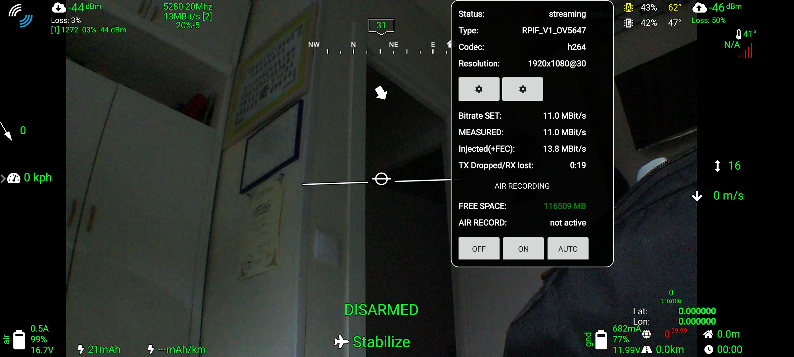

# OpenHD Flight Recording Options

<!-- LEGACY DOCUMENTATION NOTICE -->
> ⚠️ **This documentation is outdated!** A current version is available at [openhdfpv.org](https://openhdfpv.org)
> 
> [📖 **View Updated Version of This Page** →](https://openhdfpv.org)

---

OpenHD offers two methods for recording your flight footage, whether for sharing on platforms like YouTube or for personal analysis.

## 1. Air Recording

Air recording involves capturing video locally on your Air unit. This method helps eliminate any potential breakups or interference that might occur during the flight, as it records directly from the transmitted video feed.

**Note 1:** The Raspberry Pi (RPI) hardware is not capable of recording video with an on-screen display (OSD). Please refer to option 2 for OSD recording.

**Note 2:** The bitrate of the air recording is the same as the bitrate used for video transmission.

## 2. Ground Recording

Due to hardware limitations of the Raspberry Pi, which cannot record both video and OSD simultaneously, we recommend the following user-proven alternative:

1. Use QOpenHD on a tablet or Android phone.
2. Employ a screen recorder (specific application to be determined) to capture the video feed along with OSD data.

If you have access to a (powerful) x86 laptop on the ground, you can also utilize its integrated screen recording capabilities, OBS is preinstalled on our images and recommended for perfect Hardware utilisation.

### Air Recording - Enable/Disable:

You can manage air recording by either manually enabling/disabling the recording of your primary or secondary camera via QOpenHD or by using the following recommended feature:

Record your flights locally on your air unit with minimal performance impact. The recorded video maintains the same bitrate as the transmitted video but is free from breakups due to packet loss since it's stored locally on your air unit, not the ground unit.

To enable this feature:

1. Enable video recording for a connected camera. You have two options or using the sidebar or the video statistic tab.
You can set it to OFF, ON or Auto, in AUTO the system will start recording automatically when arm the UAV

2. To access and view the recordings, you have two options:

- **Option a**: After a flight, remove the SD card from your air unit and insert it into a card reader. You can find the recordings in the partition named "RECORDINGS".

- **Option b**: After a flight, enable the "Wi-Fi hotspot" on your air Pi (requires a Pi with integrated Wi-Fi). Connect your phone or PC to the Pi's Wi-Fi network, open a web browser, enter the Pi's IP address. You will access its web interface, where you can find the video files.

# Recording Widget

You will see a red dot next to camera icon and MBits

**Note:** If there is insufficient free space on your Air unit's SD card, air recording will automatically stop.
