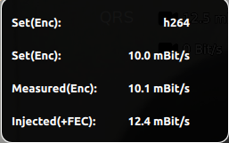

# Variable Bitrate in OpenHD Evo

<!-- LEGACY DOCUMENTATION NOTICE -->
> ⚠️ **This documentation is outdated!** A current version is available at [openhdfpv.org](https://openhdfpv.org)
> 
> [📖 **View Updated Version of This Page** →](https://openhdfpv.org)

---

One of the primary objectives of OpenHD Evo is to introduce support for variable bitrate, aiming to align with other commercial FPV systems. However, achieving this goal can be challenging due to the diverse range of devices and setups that OpenHD supports, many of which may not inherently support variable bitrate at the hardware level. Here's a quick guide for both experienced and new users to navigate this feature.

1. **Default Variable Bitrate (As of 2.3.2)**:
   - Variable bitrate is enabled by default in OpenHD Evo starting from version 2.3.2.
   - This means that OpenHD recommends bitrates to the encoder based on the selected link parameters and reduces the bitrate in the event of transmission errors.
   - Variable bitrate functionality is currently available for select cameras (see point 3).

2. **Managing Variable Bitrate**:
   - To mitigate the risk of overtaxing the link during flight, OpenHD Evo's default behavior is to automatically decrease the bitrate when necessary.
   - For experienced users who are familiar with their exact bitrate requirements, it's advisable to disable variable bitrate temporarily.
   - To disable variable bitrate, use the QOpenHD parameter editor:
     - Navigate to "OpenHD -> Air(TMP)" and disable the option as shown below:
     
   - After disabling variable bitrate, you can manually adjust the encoder bitrate in the CAM1 (and optionally CAM2) registry.

3. **Camera Compatibility**:
   - It's important to note that many cameras, especially USB cameras, VEYE, and the Raspberry Pi CSI to HDMI adapter, may not fully support variable bitrate.
   - To troubleshoot compatibility issues, observe the set and measured encoder bitrates. If you notice regular overshoots or undershoots, consider disabling variable bitrate and fine-tuning your link parameters to align with your camera's requirements.
   - Here's an example of a camera properly adhering to the set encoder bitrate:
     

4. **Supported Wi-Fi Cards for Variable Link Rate**:
   - The RTL8812AU chipset (and other chips using the RTL88xxAU or RTL88x2BU driver) are the only Wi-Fi cards that support variable link rates in OpenHD Evo.
   - With these cards, you can adjust the MCS index (modulation) and channel width (20MHz or 40MHz), which affects the throughput (rate) of your RF link.

Variable bitrate in OpenHD Evo enhances your flexibility in adapting your video stream to different scenarios. However, it's essential to be aware of camera compatibility and manage this feature effectively, especially if you are an experienced user looking for precise control over bitrates.
